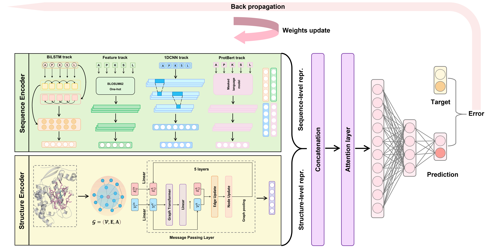
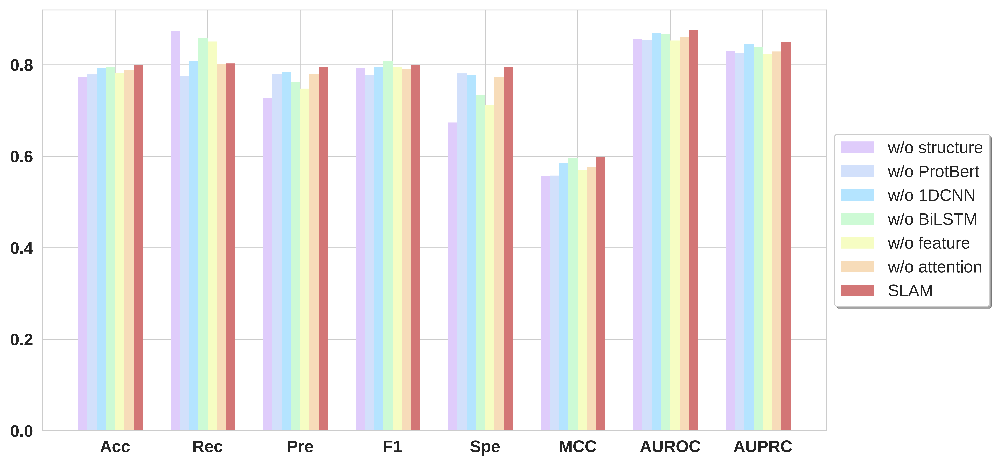
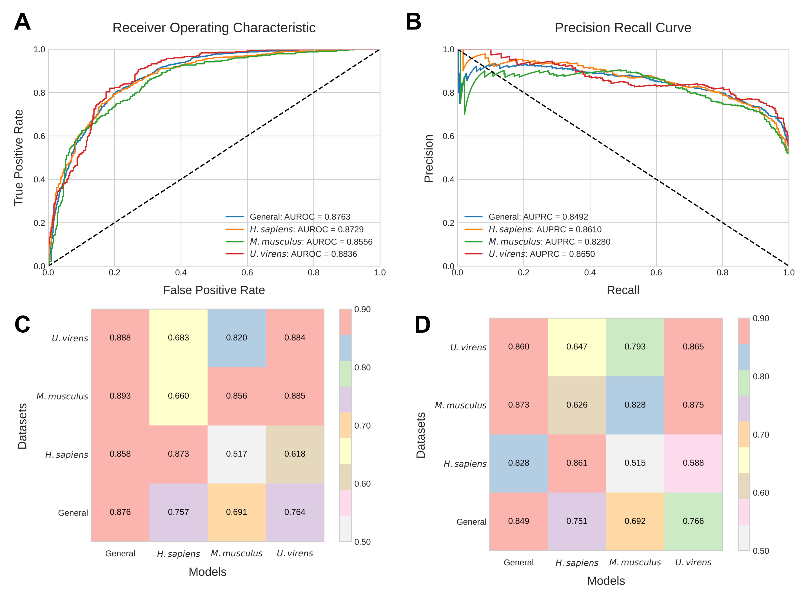
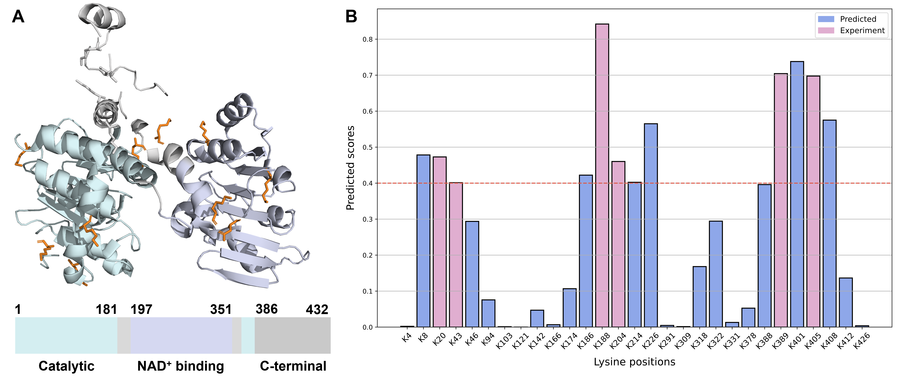

# SLAM

This is a repository containing source code for paper title "SLAM: structure-aware lysine β-hydroxybutyrylation prediction with protein language model".

# Introduction

​	Post-translational modifications (PTM) in proteins expand the functional diversity that are vital for their functions and stability. As a newly-reported PTM, lysine β-hydroxybutyrylation (Kbhb) presents a new avenue to regulate chromatin and diverse functions. Therefore, accurate and efficient prediction of Kbhb sites is imperative. However, the current experimental methods for identifying PTM sites are often expensive and time-consuming. Up to now, there is no computational method for Kbhb sites detection. To this end, we present the first deep learning-based method, termed SLAM, to *in silico* identify lysine β-hydroxybutyrylation. The performance of SLAM is evaluated on both 5-fold cross-validation and independent test sets for general and three species, achieving 0.876, 0.873, 0.856 and 0.884 in terms of AUC values, respectively on the general and species-specific independent test sets. Furthermore, we found that the species-specific prediction is important for organism with large-scale data, and general prediction still servers as the best approach in species with small-sized dataset. With various *in silico* experiments, it is confirmed that structure, and information obtained from protein language model and handcrafted features are key contributors to a robust and accurate predictor. As one example, we predicted the potential Kbhb sites in human S-adenosyl-L-homocysteine hydrolase, which is in agreement with experimentally-verified Kbhb sites. Taken together, our method could enable accurate and efficient discovery of novel Kbhb sites that are crucial for the function and stability of proteins and could be applied in the structure-guided identification of other important PTMs. The web-server of SLAM is freely accessible at [SLAM](https://github.com/Gabriel-QIN/SLAM).


# Method summary

## Architecture

​	Hence, we present a hybrid deep learning neural Networks combining Structure and LAnguage-Model constraints (SLAM), for species-specific and general protein lysine β-hydroxybutyrylation site prediction. The developed geometric deep learning framework includes 1) a multi-track encoder module to concurrently embed the protein structure and sequence features into a latent representation; 2) a decoder layer consisting of an attention layer and a multi-layer perceptron followed with a sigmoid function for downstream classification. The sequence encoder is designed as hybrid deep learning neural networks to learn dependencies between residues with two-track feature encoders and two-track adaptive encoders. Adaptive encoders enable learn-from-data for SLAM by using learnable word embeddings, and feature encoders privodes expert-level information and evolutionary constraints extracted from protein language model. For structure encoder, a multi-layer graph neural network (GNN) is implemented to capture high-level residue relationships considering geometry. 



## Ablation studies

​	Since whether each sub-encoder of SLAM is essential for Kbhb prediction remains uncertain, a number of ablation experiments had been conducted. Specifically, we respectively removed structure encoder, ProtBert encoder, 1DCNN encoder, BiLSTM encoder, feature encoder and attention module in the SLAM model. As illustrated in the below figure, we can notice that removal of each sub-module of SLAM all leads to decline of AUROC, ranging from 0.009 to 0.023, and AUPRC values, ranging from 0.003 to 0.025. For other overall evaluation metrics, such as MCC and F1-score, SLAM model without each sub-module exhibited worsen performance. Among all of the six ablation experiments, the contribution of structure encoder, feature encoder and ProtBert encoder appears to be the highest, leading to decrease of 0.020, 0.023 and 0.022 in AUROC values, respectively. It follows that the structure information, embedding taken from ProtBert and manual encodings exhibit informative features that are key for accurate identification of Kbhb sites. CNN and BiLSTM encoders have the least influence, decreasing AUROC values less than 0.1. We suppose that the reason is the SLAM model can obtain information from five sequence-based encoders and the model can learn information from other sequence encoders when removing these two embedding-based sequence encoders. For indicators including Acc, Rec, Pre and Spe, the SLAM stably maintained around 0.8, while ablated models showed erratic patterns. For instance, after removing structure encoder, the Pre and Spe declined from 0.796 and 0.795 to 0.728 and 0.674, although its Rec hit 0.873, the highest among all the ablation experiments.



# Requirements

Python version: >=`3.7.*`

Several common packages are used in this project.

1. For data processing: python built-in packages such as `re` and `collentions`, and `Biopython`;
2. For deep learning model implementation: `PyTorch 1.13.1 + cu117` for deep neural networks, `PyTorch geometric 2.3.1` and `torch_scatter 2.1.1` for graph neural networks, `transformers 4.30.2` for pre-trained models;
3. For model evaluations and result plots:`scikit-learn` and `matplotlib`

Using the following commands to create your own conda environment:

First make sure you have [conda](https://docs.conda.io/projects/conda/en/stable/user-guide/install/index.html) or [Miniconda](https://docs.anaconda.com/free/miniconda/)) installed in your machine  using command `which conda` (for Linux).

## Step1

```sh
conda create -n SLAM python==3.7 && conda activate SLAM
pip install numpy pandas matplotlib biopython scikit-learn transformers
```

## Step2

For PyTorch and PyTorch geometric (PyG):

You can use install via Anaconda:

```sh
conda install pytorch==1.13.1 pytorch-cuda=11.7 -c pytorch -c nvidia
pip install torch_geometric
conda install pyg=*=*cu* -c pyg
```

Or using wheels:

```sh
pip install torch==1.13.1+cu117 --extra-index-url https://download.pytorch.org/whl/cu117
pip install torch_geometric
pip install torch_scatter torch_cluster --no-index -f https://data.pyg.org/whl/torch-1.13.1+cu117.html
```

Finally, check the installations by:

```python
python -c "import torch; print(torch.cuda.is_available())"	# Should be True
python -c "import torch; print(torch.cuda.device_count())"	# Should be > 0
python -c "import torch; print(torch.__version__);print(torch.version.cuda)"
```

For more information, please follow the official documentation of [PyTorch ](https://pytorch.org/get-started/locally/)and [PyG)](https://pytorch-geometric.readthedocs.io/en/latest/install/installation.html).


# Getting started

After done the required installations,  you can quickly re-train our model or predict your own data with high-throughput.


# Descriptions of this repository

1. Codes
2. Datasets
3. Plotting
4. Case study


# Evaluation on species-specific datasets

## 1. Evaluation on independent test sets

```sh
dataset=Datasets
sp=general
gpu=0
python codes/SLAM.py --encoder cnn,lstm,fea,plm,gnn --project SLAM_general_prediction --train ${dataset}/${sp}_train.fa --test Datasets/${sp}_test.fa --gpu ${gpu} --seed 2024
```





|   Species   | Accuracy | Recall | Precision | F1-score | Specificity |  MCC  |  AUC  | AUPRC |
| :---------: | :------: | :----: | :-------: | :------: | :---------: | :---: | :---: | :---: |
|   General   |  0.799   | 0.803  |   0.796   |  0.800   |    0.795    | 0.598 | 0.876 | 0.849 |
| H. sapiens  |  0.796   | 0.787  |   0.802   |  0.794   |    0.806    | 0.592 | 0.873 | 0.861 |
| M. musculus |  0.778   | 0.862  |   0.738   |  0.795   |    0.694    | 0.565 | 0.856 | 0.828 |
|   U.viren   |  0.816   | 0.904  |   0.768   |  0.831   |    0.728    | 0.642 | 0.884 | 0.865 |


## 2. Evaluation using 5-fold cross-validation


|   Species   | Accuracy | Recall | Precision | F1-score | Specificity |  MCC  |  AUC  | AUPRC |
| :---------: | :------: | :----: | :-------: | :------: | :---------: | :---: | :---: | :---: |
|   General   |  0.777   | 0.845  |   0.744   |  0.790   |    0.706    | 0.559 | 0.850 | 0.831 |
| H. sapiens  |  0.772   | 0.808  |   0.756   |  0.780   |    0.735    | 0.546 | 0.842 | 0.833 |
| M. musculus |  0.709   | 0.795  |   0.684   |  0.722   |    0.609    | 0.438 | 0.795 | 0.777 |
|   U.viren   |  0.745   | 0.794  |   0.727   |  0.755   |    0.692    | 0.496 | 0.812 | 0.784 |


# Reproducing artworks in SLAM paper

Please kindly follow the instructions in the jupyter notebook: `Draw_figures.ipynb`


# Case study on AHCY

​	AHCY, short for S-adenosyl-L-homocysteine hydrolase, is the only enzyme that can hydrolyze SAH in mammalian[1]. In human cells, it is reported that the loss of AHCY is a causal factor for embryonic lethality[2], and the deficiency can lead to numerous diseases, including neurological disorders, cancer (e.g., hepatocellular carcinoma), early childhood death, and myopathy[3].  Despite the functional investigation of AHCY by previous experimental studies, its regulation remains largely underexplored. Previous studies had already confirmed that AHCY is a bona fide target of Kbhb which could potentially exerts impact on the enzymatic activity[4]. They found that the AHCY activity was attenuated after an 8h treatment of 10mM Na-β-OHB treatment[4]. 

​	Given the AHCY sequence (Uniprot: [P23526](https://www.uniprot.org/uniprotkb/P23526)) and NAD+-bound structure ([PDB: 5W49](https://www.rcsb.org/structure/5W49)), we further predicted 6 potential β-hydroxybutyrylated sites including K8, K186, K214, K226, K401 and K408 . The SLAM model is capable of predicting all six experimentally-verified Kbhb sites. K188 is predicted with a relatively high score (i.e., 0.842), while K380 and K405 are predicted with a medium score (i.e., 0.5~0.8), and K20, K43 and K204 merely pass the defined threshold (i.e., 0.4). For making predictions with your own case, please carefully follow the instructions in the jupyter notebook: `Case_study.ipynb`, and replace files with your sequence and structure.



**References:**

[1] S. Aranda, A. Alcaine-Colet, E. Blanco, *et al*., Chromatin capture links the metabolic enzyme AHCY to stem cell proliferation, Science Advances 5(3) (2019) eaav2448.

[2] M.E. Dickinson, A.M. Flenniken, X. Ji, *et al*., High-throughput discovery of novel developmental phenotypes, Nature 537(7621) (2016) 508-514.

[3] P. Vizan, L. Di Croce, S. Aranda, Functional and Pathological Roles of AHCY, Front Cell Dev Biol 9 (2021) 654344.

[4] K.B. Koronowski, C.M. Greco, H. Huang, *et al*., Ketogenesis impact on liver metabolism revealed by proteomics of lysine beta-hydroxybutyrylation, Cell Rep 36(5) (2021) 109487.


# Citation

If you find SLAM helpful in your study, please kindly cite the following paper:


BibTeX entry:

```bibtex
@article{auto-kla,
    title={SLAM: structure-aware lysine beta-hydroxybutyrylation prediction with protein language model},
    author={Zhao-hui Qin, Zhen Chen},
    journal={bioRxiv},
    year={2024}
}
```


# License

This repository is licensed under the terms of the **Apache 2.0** license.