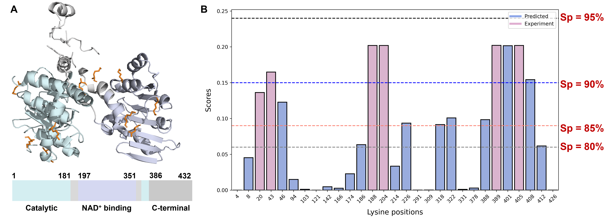

# `` SLAM

> This is a repository containing source code for paper titled "SLAM: structure-aware lysine β-hydroxybutyrylation prediction with protein language model".

# Introduction

Post-translational modifications (PTMs) in proteins expand the functional diversity that are vital for their functions and stability. As a newly-reported PTM, lysine β-hydroxybutyrylation (Kbhb) presents a new avenue to regulate chromatin and diverse functions. Therefore, accurate and efficient prediction of Kbhb sites is imperative. However, the current experimental methods for identifying PTM sites are often expensive and time-consuming. Up to now, there is no computational method for Kbhb sites detection. To this end, we present the first deep learning-based method, termed SLAM, to *in silico* identify lysine β-hydroxybutyrylation. The performance of SLAM is evaluated on both 5-fold cross-validation and independent test, achieving 0.890, 0.899, 0.907 and 0.923 in terms of AUROC values, on the general and species-specific independent test sets, respectively. Furthermore, we found that the species-specific prediction is important for organism with large-scale data, and general prediction still serves as the best approach in species with small-sized datasets. Through extensive *in silico* experiments, it has been confirmed that the structure, along with information obtained from protein language model and handcrafted features, are key contributors to a robust and accurate predictor. As one example, we predicted the potential Kbhb sites in human S-adenosyl-L-homocysteine hydrolase, which is in agreement with experimentally-verified Kbhb sites. In summary, our method could enable accurate and efficient discovery of novel Kbhb sites that are crucial for the function and stability of proteins and could be applied in the structure-guided identification of other important PTMs. The web-server of SLAM is freely accessible at [SLAM server](https://ai4bio.online/SLAM/).


# SLAM method

## Model architecture

Here, we present a hybrid deep learning neural Networks combining Structure and LAnguage-Model constraints (SLAM), for species-specific and general protein lysine β-hydroxybutyrylation site prediction. The developed geometric deep learning framework includes 1) a multi-track encoder module to concurrently embed the protein structure and sequence features into a latent representation; 2) a decoder layer consisting of an attention layer and a multi-layer perceptron followed with a sigmoid function for downstream classification. The sequence encoder is designed as hybrid deep learning neural networks to learn dependencies between residues with two-track feature encoders and two-track adaptive encoders. Adaptive encoders enable learn-from-data for SLAM by using learnable word embeddings, and feature encoders provide expert-level information and evolutionary constraints extracted from protein language model. For structure encoder, a multi-layer graph neural network (GNN) is implemented to capture high-level residue relationships considering geometry.


## Requirements

Python version: >=`3.7`

Several common packages are used in this project.

1. For data processing: python built-in packages such as `re` and `collentions`, and `Biopython`;
2. For deep learning model implementation: `PyTorch 1.13.1 + cu117` for deep neural networks, `PyTorch geometric 2.3.1` and `torch_scatter 2.1.1` for graph neural networks, `transformers 4.30.2` for pre-trained models;
3. For model evaluations and result plots:`scikit-learn` and `matplotlib`

Using the following commands to create your own conda environment:

First make sure you have [conda](https://docs.conda.io/projects/conda/en/stable/user-guide/install/index.html) or [miniconda](https://docs.anaconda.com/free/miniconda/) installed in your machine  using command `which conda` (for Linux).

### Step1

```sh
conda create -n SLAM python==3.7 && conda activate SLAM
pip install numpy pandas matplotlib seaborn biopython scikit-learn transformers
```

### Step2

For PyTorch and PyTorch geometric (PyG):

You can install via Anaconda:

```sh
conda install pytorch==1.13.1 pytorch-cuda=11.7 -c pytorch -c nvidia
pip install torch_geometric
conda install pyg=*=*cu* -c pyg
```

Or install by wheels:

```sh
pip install torch==1.13.1+cu117 --extra-index-url https://download.pytorch.org/whl/cu117
pip install torch_geometric
pip install torch_scatter torch_cluster --no-index -f https://data.pyg.org/whl/torch-1.13.1+cu117.html
```

If you are running on a CPU-only machine, it is recommended to install the CPU version of these packages using following commands:

```sh
pip install torch==1.13.1
pip install torch_geometric
pip install torch_scatter torch_cluster -f https://data.pyg.org/whl/torch-1.13.1+cpu.html
```

Finally, check the installations by:

```python
python -c "import torch; print(torch.cuda.is_available())"	# Should be True
python -c "import torch; print(torch.cuda.device_count())"	# Should be > 0
python -c "import torch; print(torch.__version__);print(torch.version.cuda)"
```

For more information, please refer to the official documentation of [PyTorch ](https://pytorch.org/get-started/locally/)and [PyG](https://pytorch-geometric.readthedocs.io/en/latest/install/installation.html).

### Alternative

You can simply  can use this `requirements.txt` file to install all the dependencies.

```sh
pip install -r requirements.txt
```

You can read more in [Virtualenv and pip Basics](http://jonathanchu.is/posts/virtualenv-and-pip-basics/), and the official [Requirements File Format](https://pip.pypa.io/en/stable/cli/pip_install/) documentation.

### Protein language model

Before running SLAM on your local machine, you need to prepare the pretrained protein language model ProtBert:
Download the pretrained ProtBert model ( [link](https://huggingface.co/Rostlab/prot_bert) | [guide](https://github.com/agemagician/ProtTrans)).

## Getting started

After finishing the required installations,  you can quickly re-train our model or predict your own data in a high-throughput manner.

# Reproducing the SLAM method

## Descriptions of this repository

1. Codes

   - [dataset.py](https://github.com/Gabriel-QIN/SLAM/tree/master/codes/dataset.py) : dataset preparation and processing
   - [model.py](https://github.com/Gabriel-QIN/SLAM/tree/master/codes/model.py) : PyTorch-version SLAM model
   - [metrics.py](https://github.com/Gabriel-QIN/SLAM/tree/master/codes/metrics.py) : validation metrics and additional utils
   - [SLAM.py](https://github.com/Gabriel-QIN/SLAM/tree/master/codes/SLAM.py) : for structure-guided SLAM training
   - [predict.py](https://github.com/Gabriel-QIN/SLAM/blob/master/codes/predict.py): for predicting Kbhb with/without structures
   - [hypara.py](https://github.com/Gabriel-QIN/SLAM/blob/master/codes/hypara.py): SLAM model hyperparameter
2. Datasets

   - Sequence datasets:
     - [species-specific datasets](https://github.com/Gabriel-QIN/SLAM/blob/master/Datasets) for species specific predictions.
   - Structure datasets: please download from [SLAM server ](http://ai4bio.online/softwares/SLAM/download/)when training the structure-guided model (i.e., add  `structure` flag in the `encoder_list` in [SLAM.py](https://github.com/Gabriel-QIN/SLAM/tree/master/codes/SLAM.py) ).
3. Models

   - Please download the pickled models from [SLAM server](https://ai4bio.online/SLAM/download/).
4. Case study

   - [case study](https://github.com/Gabriel-QIN/SLAM/tree/master/case_study)

## Evaluation on species-specific datasets

### 1. Evaluation on independent test sets

For more information, please refer to the source code for [SLAM](https://github.com/Gabriel-QIN/SLAM/tree/master/codes/SLAM.py).

```sh
dataset=Datasets
gpu=0
for sp in general human mouse false_smut
   do python codes/SLAM.py --encoder cnn,lstm,fea,plm,gnn --project SLAM_${sp}_prediction --train ${dataset}/${sp}_train_ratio_all.fa --test Datasets/${sp}_test_ratio_all.fa --gpu ${gpu} --seed 2024
done
```


|     Species     | Accuracy | Recall | Precision | F1-score | Specificity |  MCC  |  AUC  | AUPRC |
| :-------------: | :------: | :----: | :-------: | :------: | :---------: | :---: | :---: | :---: |
|     General     |  0.892  | 0.609 |   0.337   |  0.434  |    0.913    | 0.400 | 0.890 | 0.369 |
| *H. sapiens* |  0.938  | 0.469 |   0.374   |  0.416  |    0.961    | 0.386 | 0.899 | 0.355 |
| *M. musculus* |  0.901  | 0.679 |   0.583   |  0.627  |    0.932    | 0.572 | 0.907 | 0.595 |
|  *U. viren*  |  0.898  | 0.702 |   0.455   |  0.552  |    0.917    | 0.513 | 0.923 | 0.561 |

### 2. Comparison with other machine learning algorithms

```sh
cd Plots
python plot.py
```


## Case study on AHCY

```sh
cd codes
python predict.py
```

AHCY, short for S-adenosyl-L-homocysteine hydrolase, is the only enzyme that can hydrolyze SAH in mammalian[1]. In human cells, it is reported that the loss of AHCY is a causal factor for embryonic lethality[2], and the deficiency can lead to numerous diseases, including neurological disorders, cancer (e.g., hepatocellular carcinoma), early childhood death, and myopathy[3].  Despite the functional investigation of AHCY by previous experimental studies, its regulation remains largely underexplored. Previous studies had already confirmed that AHCY is a bona fide target of Kbhb which could potentially exerts impact on the enzymatic activity[4]. They found that the AHCY activity was attenuated after an 8h treatment of 10mM Na-β-OHB treatment[4].

Given the AHCY sequence (Uniprot: [P23526](https://www.uniprot.org/uniprotkb/P23526)) and NAD+-bound structure ([PDB: 5W49](https://www.rcsb.org/structure/5W49)), the SLAM model is capable of predicting all six experimentally-verified Kbhb sites. K43, K188, K204, K389 and K405 are predicted with a high score (Sp = 90%), while K20 is predicted with a medium score (Sp = 85%). We further predicted 6potential β-hydroxybutyrylated sites including K46, K226, K318, K322, K388, K401 and K408. For making predictions with your own case, please carefully follow the instructions in the jupyter notebook: `Case_study.ipynb`, and replace files with your sequence and structure.



**References:**

[1] S. Aranda, A. Alcaine-Colet, E. Blanco, *et al*., Chromatin capture links the metabolic enzyme AHCY to stem cell proliferation, Science Advances 5(3) (2019) eaav2448.

[2] M.E. Dickinson, A.M. Flenniken, X. Ji, *et al*., High-throughput discovery of novel developmental phenotypes, Nature 537(7621) (2016) 508-514.

[3] P. Vizan, L. Di Croce, S. Aranda, Functional and Pathological Roles of AHCY, Front Cell Dev Biol 9 (2021) 654344.

[4] K.B. Koronowski, C.M. Greco, H. Huang, *et al*., Ketogenesis impact on liver metabolism revealed by proteomics of lysine beta-hydroxybutyrylation, Cell Rep 36(5) (2021) 109487.

# Citation

If you find SLAM helpful in your study, please kindly cite the following [paper ](https://authors.elsevier.com/a/1joB7WFfgx8VQ):

*[APA]*

Qin, Z., Liu, H., Zhao, P., Wang, K., Ren, H., Miao, C., … Chen, Z. (2024). SLAM: Structure-aware lysine β-hydroxybutyrylation prediction with protein language model. International Journal of Biological Macromolecules, 280, 135741. doi:10.1016/j.ijbiomac.2024.135741

or

BibTeX entry:

```bibtex
@article{QIN2024135741,
title = {SLAM: Structure-aware lysine β-hydroxybutyrylation prediction with protein language model},
journal = {International Journal of Biological Macromolecules},
volume = {280},
pages = {135741},
year = {2024},
issn = {0141-8130},
doi = {https://doi.org/10.1016/j.ijbiomac.2024.135741},
url = {https://www.sciencedirect.com/science/article/pii/S0141813024065498},
author = {Zhaohui Qin and Huixia Liu and Pei Zhao and Kaiyuan Wang and Haoran Ren and Chunbo Miao and Junzhou Li and Yong-Zi Chen and Zhen Chen},
keywords = {Lysine β-hydroxybutyrylation, Graph neural network, Protein language model},
abstract = {Post-translational modifications (PTMs) diversify protein functions by adding/removing chemical groups to certain amino acid. As a newly-reported PTM, lysine β-hydroxybutyrylation (Kbhb) presents a new avenue to functional proteomics. Therefore, accurate and efficient prediction of Kbhb sites is imperative. However, the current experimental methods for identifying PTM sites are often expensive and time-consuming. Up to now, there is no computational method proposed for Kbhb sites detection. To this end, we present the first deep learning-based method, termed SLAM, to in silico identify lysine β-hydroxybutyrylation sites. The performance of SLAM is evaluated on both 5-fold cross-validation and independent test, achieving 0.890, 0.899, 0.907 and 0.923 in terms of AUROC values, on the general and species-specific independent test sets, respectively. As one example, we predicted the potential Kbhb sites in human S-adenosyl-L-homocysteine hydrolase, which is in agreement with experimentally-verified Kbhb sites. In summary, our method could enable accurate and efficient characterization of novel Kbhb sites that are crucial for the function and stability of proteins and could be applied in the structure-guided identification of other important PTM sites. The SLAM online service and source code is available at https://ai4bio.online/SLAM and https://github.com/Gabriel-QIN/SLAM, respectively.}
}
```

# License

This repository is licensed under the terms of the **Apache 2.0** [license](https://github.com/Gabriel-QIN/SLAM/blob/master/LICENSE).
